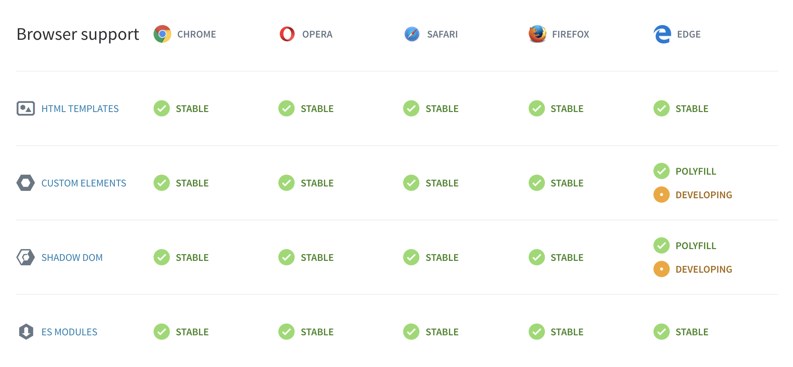

# Webcomponentsを使ったフロントエンド開発とデザイン

# 自己紹介
　Life is Tech!のWeb系コースのメンターをしているジャスティンです!
最近、技術的にはwebフロントエンド周りに興味を持ってますが、基本的にはサービス開発が好きなので色々な技術触っては、なんか作ったりしてます。

# はじめに
　さて今回は Webcomponents と CSS animation を使って下のようなanimationが出るコンポーネントを作っていこうと思います。


　とはいえ、Webcomponentsってなんなんだって感じだと思います。いきなりWebcomponents概念や実装の説明をしてもいいのですが、なぜwebcomponetnsが使われるというのかという前提知識を押さえてから、実装に移りたいと思います。なので、後編(実装編)から見たい方は前編(前提知識)を飛ばしてもらっても構いません。

# 前編(前提知識)
## webアプリケーションの変遷
  従来のwebアプリケーションの画面遷移はハイパーリンクによって遷移が行われており、遷移ごとにHTML/CSS/Javascriptなどのリソースを取得していました。そのため、画面は一時的に操作不能になり、更新差分が少ない遷移であっても、リソースが重い場合は遷移にかかる時間が長くなってしまいます。  


　そこで、webアプリケーションの画面遷移をより滑らかに、ネイティブアプリケーションのような画面遷移を実現するために、**更新する必要のある箇所だけ部分的に再描画するSPA(Single Page Application)** という設計が生まれました。この設計でよく聞くのが、ReactやVue、Angularと言ったフレームワークやライブラリーです。
※今回SPAについて詳しい説明はしないので、気になる人は是非調べてみてください。


## コンポーネント設計

　**SPA**のようにwebアプリケーションでリッチな体験を提供するようになると、UI・機能共に要求されるクオリティは高くなり**複雑な**UI/デザインになっていきます。そんな複雑なUIを組み立てるための１つの方法が**コンポーネント設計**という考え方です。
　UIのコンポーネント化はテストやメンテナンス性の向上、再利用性が高まるなど様々な利点があるのですが、今回はコンポーネントの特徴である**カプセル化**に注目していきます。

## webアプリケーション開発におけるCSS
　一旦コンポーネント設計の話から離れますが、HTMLやCSSを一度は書いた事がある人は、CSSの特性に悩まされた人も多いのでは無いでしょうか。後から宣言したセレクターが優先されたり、親と子の関係に悩まされたり、詳細度を考えたりなどなど、、、

### セレクタのスコープ
　そもそも、CSSは名前空間という概念がなく、セレクターの適用範囲はCSSが読み込まれた全てのページに適用されてしまいます。アプリケーションの大小、個人開発、チーム開発にかかわらづ古いCSSを読み新たに追加すると**意図せずセレクターが被ってしまったり**、思っていないところにセレクターが潜んでいたりして**スタイルが崩れる**と言ったこともよくあります。

### カスケード(Cascading)という性質
  また、CSSの「Cascading」とは**親の性質を全ての子が継承し、子が上書きしない限り影響を受ける**ことを表しています。BEMのようなCSS設計を利用しても、親要素の設定がカスケードする性質を持っている時、子は親の影響を受けてしまいます。

  

  ※有名なCSS設計等についての説明はちゃーはんがアドカレで説明してくれているので覗いてみてください！↓
  https://qiita.com/shou1012/items/0510b7dbe7880f830109

## webcomponentsでカプセル化
さて、コンポーネント設計の特徴の**カプセル化**に話を戻します。
CSSが「セレクターのスコープ」や「カスケード(Cascading)する性質」と言った性質があることをお話ししましたが、継続的な開発の中でその性質に悩まされる...
ここでやっと**Webcomponentsの出番です**。
要するに、webcomponentsとはCSSの影響範囲をカプセル化し、独自の要素として使えるようにする技術ということです。
※カプセル化の方法として「CSS in JS」などもありますが、今回は省略します。

## 前編まとめ
  - webアプリケーションではリッチな体験を提供するために、UIが複雑になっている。
  - コンポーネント設計が主流になっている中で、CSSをカプセル化するためにWebcomponentsを使う。

--- 

# 後編(実装編)
さていよいよ、実装編ですといきたいところですが、まずはwebcomponentsについての説明からです。

## Webcomponentsとは
> 和訳：Webcomponentsとは、WebページとWebアプリケーションで使用する新しいカスタム、再利用、カプセル化されたHTMLタグを作成できるWebプラットフォームAPIのセット。

出典：https://www.webcomponents.org/

外部ライブラリーを使わずに、独自のコンポーネントを定義したり使えるということです。

### Webcomponentsを構成する3つの使用
Webcomponentsは3つ仕様で構成されています。
  - ShadowDOM：
  https://developers.google.com/web/fundamentals/web-components/shadowdom?hl=ja
  - Custom Elements：
    https://developers.google.com/web/fundamentals/web-components/customelements?hl=ja
  - ES Modules：import/export

### Webcomponentsのサポート状況
WebcomponentsはブラウザAPIなので、各ブラウザによってサポート環境が異なります。


出典：https://www.webcomponents.org/

モダンブラウザは基本的に対応しており、edgeもDevelopingになっています。

※1 IEについて基本的に対応していないので、Polyfillsが必須になってきます。
※2 Polyfillsを使用してもサポート出来ていない仕様もあるので注意が必要。
※3 IE環境で検証していいないので、対応ブラウザでやってみてください。

## ディレクトリ構成

    dir/
    |---index.html
    |---img/
    |---webcomponents/
            |---index.js
            |---base-box.js
            |---meshi-box.js
            |---oideya-box.js


## meshi-box.js
まずは、HTMLElementを拡張してCustomElementsで定義するためのクラスを作ります。
これが独自で定義する要素になります。
```javascript
export default class MeshiBox extends HTMLElement {
  static get template() {
    return `
    <style>
       :
       :
       :
    </style>
    <section class="item-box">
      <slot></slot>
      <div class='wave-box'>
        <div class='wave one'></div>
        <div class='wave two'></div>
        <div class='wave three'></div>
      </div>
    </section>
    `
  }

  constructor() {
    super()
  }

  connectedCallback() {
    this.attachShadow({
      mode: 'open'
    }).innerHTML = MeshiBox.template;
  }
}
```
### template
  `style`と`カプセル化する要素`をここに書きます。
  上記では省略しているstyleの中で特徴的な点を説明していきます。
  ```CSS
   <style>
      :
    :host {
      margin: 50px;
    }
    ::slotted(img) {
      z-index: 1;
      width: 295px;
      height: 295px;
      border-radius: 155px;
      transition: all 300ms 0s ease-in;
      filter: drop-shadow(3px 3px 3px rgba(0,0,0,0.4));
    }
       :
    </style>
  ```
  ```HTML
    <section class="item-box">
      <slot></slot>
      <div class='wave-box'>
        <div class='wave one'></div>
        <div class='wave two'></div>
        <div class='wave three'></div>
      </div>
    </section>
  ```

  * `:host`はカスタム要素にスタイルを当てるためのセレクタです。今回の要素でいうと、`<meshi-box>`にスタイルを当てるためのセレクタ
  * `::slotted()`は`<slot>`に該当する要素にスタイルを当てるためのセレクタ
  
### this.attachShadow({ mode:'open'}) 
これが、webcomponentsを構成する仕様の１つ目の**ShadowDOM**です。
要素内にカプセル化されたDOMを追加します。developertoolで実際に要素を見てみると`<meshi-box>`要素内に`#shadow-root(open)`が増え、その中に先ほどの要素があります。


  * セレクタも`item-box`といった被りそうなclass名ですが、問題ありません。

### CSS animation 
hovre 時に周りに波のようなエフェクトをつくります。
animationプロパティと@keyframesでアニメーションのを作ることができます。


```CSS
    @keyframes drift {
      100% {
        transform: rotate(0deg);
      }
      100% {
        transform: rotate(360deg);
      }
    }

    .wave.one {
      animation: drift 10000ms infinite linear;
      background-color: rgba(243, 153, 34, 0.2);
    }
```

## index.js
ここでは、先ほど作った`HTMLElementを拡張してCustomElementsのクラス`を要素として定義してhtmlで使えるようにしています。
```javascript
    import MeshiBox from './meshi-box.js';
    import OideyaBox from './oideya-box.js';

    // 先ほど適宜した MeshiBox を meshi-box 要素として定義する
    customElements.define('meshi-box', MeshiBox);
    customElements.define('oideya-box', OideyaBox);
```

## index.html
最後に、index.htmlを見ていきましょう。
```HTML
    <!DOCTYPE html>
    <html lang="ja">
    <head>
    <meta charset="UTF-8">
    <title>Document</title>
    <script type="module" src="./webcomponents/index.js"></script>
    </head>
    <body>
    <section style="display:flex">
        <meshi-box>
            
        </meshi-box>
        <oideya-box>
            
        </oideya-box>
    </section>
    </body>
    </html>
```
基本的なHTMLの雛形ですが、普通のHTMLには無い独自に定義したタグがあります。
htmlファイルでも独自で定義した要素を扱うことができるよになりました。

 * `<script>`タグに`type="text/javascript"`ではなく`type="module"`とあると思います。これが、webcomponentsを構成する３つの使用の１つの**ES Modules**です。`type="module"`を指定しないと、importやexportなどのJSコード内の宣言がエラーになります。

# ちなみに
 実はyoutubeをdevelopertoolで見てみると、webcomponentsで作られている要素があります。(写真下部)
  

 ただ、ぱっと見shadowDOMは使われていない感じです。仕様を元に段階的に取り入れている感じがします。


# おわりに
  仕様周りにまだまだ議論の余地はあるものの、今回紹介しきれなかった応用方法もまだまだあります。webブラウザの標準仕様ということで、外部ライブラリーを使わなくても良い反面、全てのブラウザーで仕様が策定されないと全てのユーザーに同じ体験を届けることはできません。

  ただ、`フロントエンド開発とデザイン`とうい視点からみるとともても面白い技術だと思います。フロントエンドとデザインが密になりながら開発を進めていく必要がある中でwebcomponentsがどうなっていくのか楽しみです。
 

# 参考文献
  - https://www.amazon.co.jp/dp/B07CJ5TLK2/ref=dp-kindle-redirect?_encoding=UTF8&btkr=1
  - https://www.webcomponents.org/
  - https://developer.mozilla.org/ja/docs/Web/Web_Components
  - https://speakerdeck.com/aggre/realistic-web-components
  - https://ics.media/entry/16511
